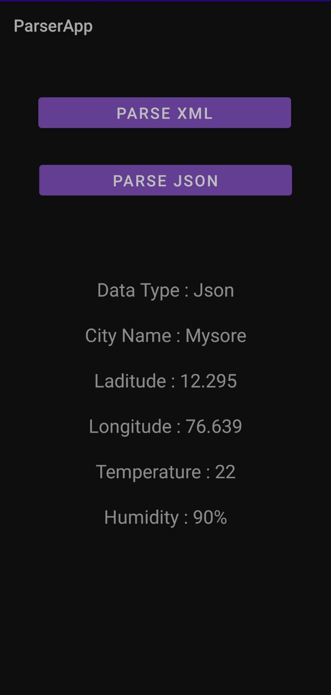

# Kotlin_Apps_College

## Visiting Card
Create an application to design a Visiting Card. The Visiting card should havea company logo at the top right corner. The company name should be displayed in Capital letters, aligned to the center. Information like the name of the employee, job title, phone number, address, email, fax and the website address is to be displayed. Insert a horizontal line between the job title and the phone number.

-------------------------------------------------------------------------------------------------------------------------------------------

## Simple Calculator
Develop an Android application usingcontrols like Button, TextView, EditText for designing a calculator having basic functionality like Addition, Subtraction, Multiplication, and Division.

  

--------------------------------------------------------------------------------------------

## SignUp SignIn
Create a SIGN Up activity with Username and Password. Validation of password should happen
based on the following rules:
 - Password should contain uppercase and lowercase letters.
 - Password should contain letters and numbers.
 - Password should contain special characters.
 - Minimum length of the password (the default value is 8).

On successful SIGN UP proceed to the next Login activity. Here the user should SIGN IN using the Username and Password created during signup activity. If the Username and Password are matched then navigate to the next activity which displays a message saying “Successful Login” or else display a toast message saying “Login Failed”.The user is given only two attempts and after that display a toast message saying “Failed Login Attempts” and disable the SIGN IN button. Use Bundle to transfer information from one activity to another.

  

0.53

-------------------------------------------------------------------------------------------------------------------------
## Wallpaper Changer

Develop an application to set an image as wallpaper. On click of a button, the wallpaper image
should start to change randomly every 30 seconds.

----------------------------------------------------------------------------------------------------------------------------

## Counter Application
Write a program to create an activity with two buttons START and STOP. On pressing of the START button, the activity must start the counter by displaying the numbers from
One and the counter must keep on counting until the STOP button is pressed. Display the counter value in a TextView.

--------------------------------------------------------------------------------------------
## Data Parser
Create two files of XML and JSON type with values for City_Name, Latitude, Longitude, Temperature, and Humidity. Develop an application to create an activity with two buttons to parse the XML and JSON files which when clicked should display the data in their respective layouts
side by side.

  

----------------------------------------------------------------------------------------------------

## Text to Speech
Develop a simple application with one EditText so that the user can write some text in it. Create a button called “Convert Text to Speech” that converts the user input text into voice.

